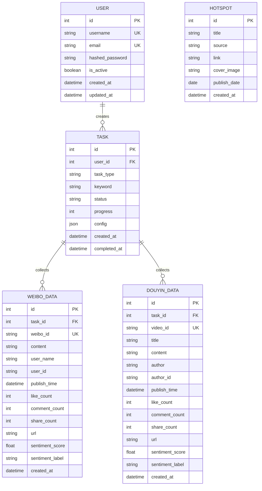

# SQLite 数据库设计文档

## 概述

本文档详细说明舆情分析系统从 CSV 文件存储迁移到 SQLite 数据库的数据模型设计、迁移方案和最佳实践。

---

## 为什么选择 SQLite

### 优势

1. **零配置**：无需安装和配置独立数据库服务
2. **文件型数据库**：单文件存储，易于备份和迁移
3. **完整的 SQL 支持**：支持事务、索引、外键、触发器
4. **高性能**：对于中小型应用性能优异
5. **跨平台**：支持所有主流操作系统
6. **可靠性**：经过广泛验证，稳定可靠
7. **轻量级**：库文件小，资源占用低

### 适用场景

- ✅ 中小型应用（< 100GB 数据）
- ✅ 读多写少的场景
- ✅ 嵌入式应用
- ✅ 开发和测试环境
- ✅ 单机部署

---

## 数据模型设计

### ER 图



---

## 数据表设计

### 1. 用户表 (users)

存储系统用户信息。

```sql
CREATE TABLE users (
    id INTEGER PRIMARY KEY AUTOINCREMENT,
    username VARCHAR(50) UNIQUE NOT NULL,
    email VARCHAR(100) UNIQUE NOT NULL,
    hashed_password VARCHAR(255) NOT NULL,
    is_active BOOLEAN DEFAULT TRUE,
    is_superuser BOOLEAN DEFAULT FALSE,
    created_at TIMESTAMP DEFAULT CURRENT_TIMESTAMP,
    updated_at TIMESTAMP DEFAULT CURRENT_TIMESTAMP
);

CREATE INDEX idx_users_username ON users(username);
CREATE INDEX idx_users_email ON users(email);
```

### 2. 任务表 (tasks)

存储爬虫任务记录。

```sql
CREATE TABLE tasks (
    id INTEGER PRIMARY KEY AUTOINCREMENT,
    user_id INTEGER,
    task_type VARCHAR(50) NOT NULL,  -- 'weibo', 'douyin', etc.
    keyword VARCHAR(200) NOT NULL,
    status VARCHAR(20) DEFAULT 'pending',  -- 'pending', 'processing', 'completed', 'failed', 'cancelled'
    progress INTEGER DEFAULT 0,  -- 0-100
    max_page INTEGER DEFAULT 10,
    config JSON,  -- 额外配置参数
    error_message TEXT,
    created_at TIMESTAMP DEFAULT CURRENT_TIMESTAMP,
    started_at TIMESTAMP,
    completed_at TIMESTAMP,
    FOREIGN KEY (user_id) REFERENCES users(id) ON DELETE SET NULL
);

CREATE INDEX idx_tasks_user_id ON tasks(user_id);
CREATE INDEX idx_tasks_status ON tasks(status);
CREATE INDEX idx_tasks_created_at ON tasks(created_at);
CREATE INDEX idx_tasks_keyword ON tasks(keyword);
```

### 3. 微博数据表 (weibo_data)

存储微博爬取的数据。

```sql
CREATE TABLE weibo_data (
    id INTEGER PRIMARY KEY AUTOINCREMENT,
    task_id INTEGER,
    weibo_id VARCHAR(50) UNIQUE NOT NULL,
    content TEXT,
    user_name VARCHAR(100),
    user_id VARCHAR(50),
    publish_time TIMESTAMP,
    like_count INTEGER DEFAULT 0,
    comment_count INTEGER DEFAULT 0,
    share_count INTEGER DEFAULT 0,
    url TEXT,
    sentiment_score REAL,  -- 0.0-1.0
    sentiment_label VARCHAR(20),  -- 'positive', 'negative', 'neutral'
    created_at TIMESTAMP DEFAULT CURRENT_TIMESTAMP,
    FOREIGN KEY (task_id) REFERENCES tasks(id) ON DELETE CASCADE
);

CREATE INDEX idx_weibo_task_id ON weibo_data(task_id);
CREATE INDEX idx_weibo_publish_time ON weibo_data(publish_time);
CREATE INDEX idx_weibo_sentiment ON weibo_data(sentiment_label);
CREATE UNIQUE INDEX idx_weibo_id ON weibo_data(weibo_id);
```

### 4. 抖音数据表 (douyin_data)

存储抖音爬取的数据。

```sql
CREATE TABLE douyin_data (
    id INTEGER PRIMARY KEY AUTOINCREMENT,
    task_id INTEGER,
    video_id VARCHAR(50) UNIQUE NOT NULL,
    title VARCHAR(500),
    content TEXT,
    author VARCHAR(100),
    author_id VARCHAR(50),
    publish_time TIMESTAMP,
    like_count INTEGER DEFAULT 0,
    comment_count INTEGER DEFAULT 0,
    share_count INTEGER DEFAULT 0,
    url TEXT,
    sentiment_score REAL,
    sentiment_label VARCHAR(20),
    created_at TIMESTAMP DEFAULT CURRENT_TIMESTAMP,
    FOREIGN KEY (task_id) REFERENCES tasks(id) ON DELETE CASCADE
);

CREATE INDEX idx_douyin_task_id ON douyin_data(task_id);
CREATE INDEX idx_douyin_publish_time ON douyin_data(publish_time);
CREATE INDEX idx_douyin_sentiment ON douyin_data(sentiment_label);
CREATE UNIQUE INDEX idx_douyin_id ON douyin_data(video_id);
```

### 5. 热点数据表 (hotspots)

存储每日热点新闻。

```sql
CREATE TABLE hotspots (
    id INTEGER PRIMARY KEY AUTOINCREMENT,
    title VARCHAR(500) NOT NULL,
    source VARCHAR(100),
    link TEXT,
    cover_image TEXT,
    publish_date DATE,
    created_at TIMESTAMP DEFAULT CURRENT_TIMESTAMP
);

CREATE INDEX idx_hotspots_date ON hotspots(publish_date);
CREATE INDEX idx_hotspots_source ON hotspots(source);
```

---

## SQLAlchemy 模型定义

### database.py - 数据库配置

```python
# backend/app/database.py
from sqlalchemy import create_engine
from sqlalchemy.ext.declarative import declarative_base
from sqlalchemy.orm import sessionmaker
from sqlalchemy.pool import StaticPool
from app.config import settings

# SQLite 数据库 URL
SQLALCHEMY_DATABASE_URL = f"sqlite:///{settings.DATABASE_PATH}"

# 创建引擎
engine = create_engine(
    SQLALCHEMY_DATABASE_URL,
    connect_args={"check_same_thread": False},  # SQLite 特定配置
    poolclass=StaticPool,  # 使用静态连接池
    echo=settings.DEBUG,  # 开发环境显示 SQL
)

# 会话工厂
SessionLocal = sessionmaker(autocommit=False, autoflush=False, bind=engine)

# 基类
Base = declarative_base()

# 依赖注入：获取数据库会话
def get_db():
    db = SessionLocal()
    try:
        yield db
    finally:
        db.close()
```

### models/user.py - 用户模型

```python
# backend/app/models/user.py
from sqlalchemy import Column, Integer, String, Boolean, DateTime
from sqlalchemy.sql import func
from app.database import Base

class User(Base):
    __tablename__ = "users"
    
    id = Column(Integer, primary_key=True, index=True)
    username = Column(String(50), unique=True, nullable=False, index=True)
    email = Column(String(100), unique=True, nullable=False, index=True)
    hashed_password = Column(String(255), nullable=False)
    is_active = Column(Boolean, default=True)
    is_superuser = Column(Boolean, default=False)
    created_at = Column(DateTime(timezone=True), server_default=func.now())
    updated_at = Column(DateTime(timezone=True), server_default=func.now(), onupdate=func.now())
    
    def __repr__(self):
        return f"<User(username='{self.username}', email='{self.email}')>"
```

### models/task.py - 任务模型

```python
# backend/app/models/task.py
from sqlalchemy import Column, Integer, String, ForeignKey, DateTime, JSON, Text
from sqlalchemy.sql import func
from sqlalchemy.orm import relationship
from app.database import Base

class Task(Base):
    __tablename__ = "tasks"
    
    id = Column(Integer, primary_key=True, index=True)
    user_id = Column(Integer, ForeignKey("users.id", ondelete="SET NULL"), nullable=True)
    task_type = Column(String(50), nullable=False)  # 'weibo', 'douyin'
    keyword = Column(String(200), nullable=False, index=True)
    status = Column(String(20), default="pending", index=True)
    progress = Column(Integer, default=0)
    max_page = Column(Integer, default=10)
    config = Column(JSON, nullable=True)
    error_message = Column(Text, nullable=True)
    created_at = Column(DateTime(timezone=True), server_default=func.now(), index=True)
    started_at = Column(DateTime(timezone=True), nullable=True)
    completed_at = Column(DateTime(timezone=True), nullable=True)
    
    # 关系
    user = relationship("User", backref="tasks")
    weibo_data = relationship("WeiboData", back_populates="task", cascade="all, delete-orphan")
    douyin_data = relationship("DouyinData", back_populates="task", cascade="all, delete-orphan")
    
    def __repr__(self):
        return f"<Task(id={self.id}, type='{self.task_type}', keyword='{self.keyword}', status='{self.status}')>"
```

### models/weibo.py - 微博数据模型

```python
# backend/app/models/weibo.py
from sqlalchemy import Column, Integer, String, Text, ForeignKey, DateTime, Float
from sqlalchemy.sql import func
from sqlalchemy.orm import relationship
from app.database import Base

class WeiboData(Base):
    __tablename__ = "weibo_data"
    
    id = Column(Integer, primary_key=True, index=True)
    task_id = Column(Integer, ForeignKey("tasks.id", ondelete="CASCADE"), nullable=True)
    weibo_id = Column(String(50), unique=True, nullable=False, index=True)
    content = Column(Text)
    user_name = Column(String(100))
    user_id = Column(String(50))
    publish_time = Column(DateTime, index=True)
    like_count = Column(Integer, default=0)
    comment_count = Column(Integer, default=0)
    share_count = Column(Integer, default=0)
    url = Column(Text)
    sentiment_score = Column(Float, nullable=True)
    sentiment_label = Column(String(20), index=True)
    created_at = Column(DateTime(timezone=True), server_default=func.now())
    
    # 关系
    task = relationship("Task", back_populates="weibo_data")
    
    def __repr__(self):
        return f"<WeiboData(id={self.id}, weibo_id='{self.weibo_id}', sentiment='{self.sentiment_label}')>"
```

---

## 数据迁移方案

### 1. 使用 Alembic 进行数据库迁移

**安装 Alembic**：
```bash
pip install alembic
```

**初始化 Alembic**：
```bash
cd backend
alembic init alembic
```

**配置 alembic.ini**：
```ini
# backend/alembic.ini
[alembic]
script_location = alembic
sqlalchemy.url = sqlite:///./public_opinion.db
```

**配置 env.py**：
```python
# backend/alembic/env.py
from app.database import Base
from app.models import user, task, weibo, douyin, hotspot

target_metadata = Base.metadata
```

**创建初始迁移**：
```bash
alembic revision --autogenerate -m "Initial migration"
alembic upgrade head
```

### 2. CSV 到 SQLite 数据迁移脚本

```python
# backend/scripts/migrate_csv_to_sqlite.py
import pandas as pd
from sqlalchemy.orm import Session
from app.database import engine, SessionLocal
from app.models.weibo import WeiboData
from app.models.task import Task
from app.models.user import User
import datetime

def migrate_weibo_data(csv_path: str, task_keyword: str):
    """迁移微博 CSV 数据到 SQLite"""
    db = SessionLocal()
    
    try:
        # 读取 CSV
        df = pd.read_csv(csv_path, encoding='utf-8')
        
        # 创建或获取任务
        task = db.query(Task).filter(Task.keyword == task_keyword).first()
        if not task:
            task = Task(
                task_type='weibo',
                keyword=task_keyword,
                status='completed',
                progress=100,
                completed_at=datetime.datetime.now()
            )
            db.add(task)
            db.flush()
        
        # 迁移数据
        for _, row in df.iterrows():
            weibo = WeiboData(
                task_id=task.id,
                weibo_id=str(row.get('微博id', '')),
                content=row.get('内容', ''),
                user_name=row.get('用户昵称', ''),
                user_id=str(row.get('用户id', '')),
                publish_time=pd.to_datetime(row.get('发布时间')),
                like_count=int(row.get('点赞数', 0)),
                comment_count=int(row.get('评论数', 0)),
                share_count=int(row.get('转发数', 0)),
                url=row.get('链接', ''),
                sentiment_score=float(row.get('情感分数', 0.5)) if '情感分数' in row else None,
                sentiment_label=row.get('情感标签', 'neutral')
            )
            
            # 检查是否已存在
            existing = db.query(WeiboData).filter(WeiboData.weibo_id == weibo.weibo_id).first()
            if not existing:
                db.add(weibo)
        
        db.commit()
        print(f"✅ 成功迁移 {len(df)} 条微博数据")
        
    except Exception as e:
        db.rollback()
        print(f"❌ 迁移失败: {str(e)}")
    finally:
        db.close()

if __name__ == "__main__":
    # 迁移示例
    migrate_weibo_data("../data/weibo_北京冬奥会.csv", "北京冬奥会")
```

### 3. 批量迁移脚本

```python
# backend/scripts/batch_migrate.py
import os
import glob
from migrate_csv_to_sqlite import migrate_weibo_data

def batch_migrate_all_csv():
    """批量迁移所有 CSV 文件"""
    csv_files = glob.glob("../data/weibo_*.csv")
    
    for csv_file in csv_files:
        # 从文件名提取关键词
        filename = os.path.basename(csv_file)
        keyword = filename.replace('weibo_', '').replace('.csv', '')
        
        print(f"迁移文件: {csv_file}")
        migrate_weibo_data(csv_file, keyword)
    
    print(f"✅ 完成所有迁移！共 {len(csv_files)} 个文件")

if __name__ == "__main__":
    batch_migrate_all_csv()
```

---

## Pydantic Schemas

### schemas/weibo.py - 微博数据模式

```python
# backend/app/schemas/weibo.py
from pydantic import BaseModel, Field
from datetime import datetime
from typing import Optional

class WeiboDataBase(BaseModel):
    weibo_id: str
    content: Optional[str] = None
    user_name: Optional[str] = None
    user_id: Optional[str] = None
    publish_time: Optional[datetime] = None
    like_count: int = 0
    comment_count: int = 0
    share_count: int = 0
    url: Optional[str] = None

class WeiboDataCreate(WeiboDataBase):
    task_id: Optional[int] = None

class WeiboDataResponse(WeiboDataBase):
    id: int
    sentiment_score: Optional[float] = None
    sentiment_label: Optional[str] = None
    created_at: datetime
    
    class Config:
        from_attributes = True  # Pydantic v2
```

---

## 数据库操作示例

### 1. 查询数据

```python
# 查询任务列表
from app.database import get_db
from app.models.task import Task

def get_tasks(db: Session, skip: int = 0, limit: int = 10):
    return db.query(Task).offset(skip).limit(limit).all()

# 查询微博数据（带关联）
from app.models.weibo import WeiboData

def get_weibo_with_task(db: Session, weibo_id: str):
    return db.query(WeiboData).filter(WeiboData.weibo_id == weibo_id).first()
```

### 2. 插入数据

```python
def create_weibo(db: Session, weibo_data: dict):
    weibo = WeiboData(**weibo_data)
    db.add(weibo)
    db.commit()
    db.refresh(weibo)
    return weibo
```

### 3. 更新数据

```python
def update_task_status(db: Session, task_id: int, status: str, progress: int):
    task = db.query(Task).filter(Task.id == task_id).first()
    if task:
        task.status = status
        task.progress = progress
        db.commit()
        db.refresh(task)
    return task
```

---

## 性能优化

### 1. 索引优化

```sql
-- 复合索引
CREATE INDEX idx_weibo_task_sentiment ON weibo_data(task_id, sentiment_label);
CREATE INDEX idx_tasks_user_status ON tasks(user_id, status);
```

### 2. 查询优化

```python
# 使用 join 避免 N+1 查询
from sqlalchemy.orm import joinedload

tasks = db.query(Task).options(joinedload(Task.weibo_data)).all()
```

### 3. 批量操作

```python
# 批量插入
db.bulk_insert_mappings(WeiboData, weibo_list)
db.commit()
```

---

## 备份和恢复

### 备份

```bash
# 备份数据库文件
cp backend/public_opinion.db backend/public_opinion_backup_$(date +%Y%m%d).db

# 导出为 SQL
sqlite3 backend/public_opinion.db .dump > backup.sql
```

### 恢复

```bash
# 从备份文件恢复
cp backend/public_opinion_backup_20251226.db backend/public_opinion.db

# 从 SQL 文件恢复
sqlite3 backend/public_opinion.db < backup.sql
```

---

## 常见问题

### 1. SQLite 并发问题

**问题**：多个请求同时写入时可能出现锁定

**解决**：
- 使用 WAL 模式（Write-Ahead Logging）
- 合理设置超时时间
- 考虑使用连接池

```python
# 启用 WAL 模式
engine = create_engine(
    SQLALCHEMY_DATABASE_URL,
    connect_args={
        "check_same_thread": False,
        "timeout": 30,
    },
    pool_pre_ping=True,
)

# 在数据库初始化时启用 WAL
def init_db():
    connection = engine.raw_connection()
    connection.execute("PRAGMA journal_mode=WAL;")
```

### 2. 数据库文件过大

**解决**：
- 定期清理旧数据
- 使用 VACUUM 命令压缩数据库

```sql
-- 清理并压缩
VACUUM;
```

---

## 参考资源

- [SQLite 官方文档](https://www.sqlite.org/docs.html)
- [SQLAlchemy 文档](https://docs.sqlalchemy.org/)
- [Alembic 文档](https://alembic.sqlalchemy.org/)
