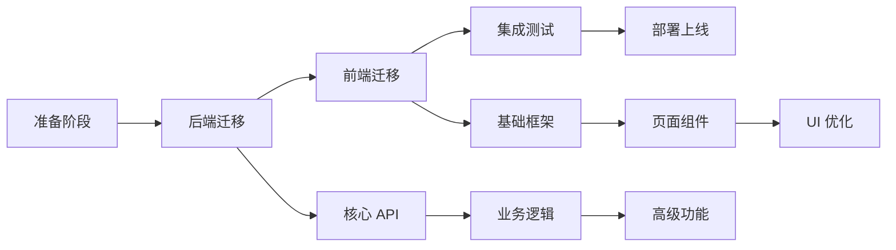

# 技术栈迁移指南

## 概述

本文档详细说明如何将现有的 Flask + Jinja2 模板舆情分析系统迁移到 React + FastAPI 现代化架构。

---

## 迁移背景

### 为什么要迁移？

1. **前后端分离**：实现更清晰的架构，前后端独立开发和部署
2. **提升开发效率**：React 组件化开发，FastAPI 自动生成 API 文档
3. **更好的用户体验**：单页应用（SPA），无刷新页面切换
4. **可维护性**：代码解耦，职责清晰，易于扩展
5. **现代化技术栈**：使用业界最佳实践和工具

### 技术对比

| 方面 | 旧技术栈 | 新技术栈 | 优势 |
|------|---------|---------|------|
| 后端框架 | Flask | FastAPI | 自动 API 文档、类型检查、异步支持 |
| 前端渲染 | Jinja2 模板 | React | 组件化、状态管理、丰富生态 |
| API 风格 | 模板渲染 | RESTful API | 标准化、可复用、易测试 |
| 开发模式 | 耦合 | 前后端分离 | 独立开发、并行工作 |
| 性能 | 同步 | 异步 | 更高并发、更快响应 |

---

## 迁移策略

### 整体原则

1. **保持功能完整**：不改变现有任何功能
2. **数据向后兼容**：保持数据格式和存储方式
3. **分阶段实施**：降低风险，便于回滚
4. **充分测试**：每个阶段完成后立即测试
5. **文档同步**：代码和文档同步更新

### 迁移顺序



---

## 详细步骤

### 阶段一：准备工作

#### 1. 环境准备

**后端环境**：
```bash
# Python 版本：3.10+
python --version

# 创建虚拟环境
cd /Volumes/external\ disk/develop/public_opinion/backend
python -m venv venv
source venv/bin/activate  # macOS/Linux

# 安装 FastAPI 和依赖
pip install fastapi uvicorn[standard] python-multipart
```

**前端环境**：
```bash
# Node.js 版本：18+
node --version
npm --version

# 创建 React 项目
cd /Volumes/external\ disk/develop/public_opinion/frontend
npm create vite@latest . -- --template react-ts
npm install
```

#### 2. 数据备份

```bash
# 备份整个项目
cd /Volumes/external\ disk/develop/public_opinion
tar -czf backup_$(date +%Y%m%d).tar.gz .

# 备份数据文件
cp -r data/ data_backup/
cp -r static/content/ static/content_backup/
```

#### 3. Git 分支管理

```bash
# 创建迁移分支
git checkout -b feature/react-fastapi-migration

# 创建子分支
git checkout -b feature/backend-migration
git checkout -b feature/frontend-migration
```

---

### 阶段二：后端 FastAPI 迁移

#### 1. 项目结构初始化

```bash
cd backend
mkdir -p app/routers
touch app/__init__.py app/main.py app/config.py app/dependencies.py
touch app/routers/__init__.py
```

#### 2. 核心文件实现

**app/main.py - FastAPI 应用入口**：
```python
from fastapi import FastAPI
from fastapi.middleware.cors import CORSMiddleware
from fastapi.staticfiles import StaticFiles
from app.routers import auth, spider, analysis, monitor, tasks
from app.config import settings
import logging

# 配置日志
logging.basicConfig(level=logging.INFO)
logger = logging.getLogger(__name__)

# 创建 FastAPI 应用
app = FastAPI(
    title="舆情分析系统 API",
    description="基于 FastAPI 的舆情分析系统后端接口",
    version="2.0.0",
    docs_url="/docs",
    redoc_url="/redoc"
)

# CORS 配置
app.add_middleware(
    CORSMiddleware,
    allow_origins=settings.ALLOWED_ORIGINS,
    allow_credentials=True,
    allow_methods=["*"],
    allow_headers=["*"],
)

# 注册路由
app.include_router(auth.router, prefix="/api/auth", tags=["认证"])
app.include_router(spider.router, prefix="/api/spider", tags=["爬虫"])
app.include_router(analysis.router, prefix="/api/analysis", tags=["分析"])
app.include_router(monitor.router, prefix="/api/monitor", tags=["监控"])
app.include_router(tasks.router, prefix="/api/tasks", tags=["任务"])

@app.on_event("startup")
async def startup_event():
    logger.info("应用启动中...")
    # 初始化资源
    
@app.on_event("shutdown")
async def shutdown_event():
    logger.info("应用关闭中...")
    # 清理资源

@app.get("/")
async def root():
    return {
        "message": "舆情分析系统 API",
        "version": "2.0.0",
        "docs": "/docs"
    }

@app.get("/health")
async def health_check():
    return {"status": "healthy"}
```

**app/config.py - 配置管理**：
```python
from pydantic_settings import BaseSettings
from typing import List
import os

class Settings(BaseSettings):
    # 应用配置
    APP_NAME: str = "舆情分析系统"
    DEBUG: bool = False
    
    # CORS 配置
    ALLOWED_ORIGINS: List[str] = ["http://localhost:5173", "http://localhost:3000"]
    
    # 安全配置
    SECRET_KEY: str
    ALGORITHM: str = "HS256"
    ACCESS_TOKEN_EXPIRE_MINUTES: int = 60 * 24 * 7  # 7 天
    
    # AI 配置
    AI_MODEL_TYPE: str = "zhipuai"
    AI_API_KEY: str = ""
    AI_BASE_URL: str = ""
    AI_MODEL_ID: str = ""
    
    # 性能配置
    ENABLE_CACHE: bool = True
    CACHE_DURATION: int = 300
    MAX_WORKERS: int = 4
    
    # 数据路径
    DATA_DIR: str = "../data"
    STATIC_DIR: str = "../static"
    
    class Config:
        env_file = ".env"
        case_sensitive = True

settings = Settings()
```

#### 3. 路由迁移示例

**app/routers/spider.py - 爬虫相关 API**：
```python
from fastapi import APIRouter, HTTPException, BackgroundTasks
from pydantic import BaseModel
from typing import Optional
import sys
sys.path.append('..')
from spiders.articles_spider import get_weibo_list
from spiders.douyin import get_douyin_list

router = APIRouter()

class SpiderRequest(BaseModel):
    keyword: str
    max_page: int = 10
    async_mode: bool = False

class SpiderResponse(BaseModel):
    task_id: Optional[str] = None
    message: str
    data: Optional[dict] = None

@router.post("/weibo/search", response_model=SpiderResponse)
async def search_weibo(request: SpiderRequest, background_tasks: BackgroundTasks):
    """微博搜索接口"""
    if not request.keyword or not request.keyword.strip():
        raise HTTPException(status_code=400, detail="关键词不能为空")
    
    if request.max_page < 1 or request.max_page > 50:
        request.max_page = min(max(request.max_page, 1), 50)
    
    keyword = request.keyword.strip()
    
    if request.async_mode:
        # 异步处理
        import uuid
        task_id = f"weibo_{keyword}_{uuid.uuid4().hex[:8]}"
        background_tasks.add_task(get_weibo_list, keyword, request.max_page)
        return SpiderResponse(
            task_id=task_id,
            message="搜索任务已提交",
            data={"keyword": keyword, "status": "processing"}
        )
    else:
        # 同步处理
        results = get_weibo_list(keyword, request.max_page)
        return SpiderResponse(
            message="搜索完成",
            data=results
        )

@router.post("/douyin/search", response_model=SpiderResponse)
async def search_douyin(request: SpiderRequest, background_tasks: BackgroundTasks):
    """抖音搜索接口"""
    if not request.keyword or not request.keyword.strip():
        raise HTTPException(status_code=400, detail="关键词不能为空")
    
    keyword = request.keyword.strip()
    results = get_douyin_list(keyword, request.max_page)
    
    return SpiderResponse(
        message="抖音搜索完成",
        data=results
    )
```

#### 4. 业务模块适配

**路径调整**：
```python
# 旧代码（Flask）
from model.nlp import sentiment_analysis

# 新代码（FastAPI）
import sys
sys.path.append('..')
from model.nlp import sentiment_analysis
```

**依赖注入**：
```python
# app/dependencies.py
from fastapi import Depends, HTTPException, status
from fastapi.security import HTTPBearer, HTTPAuthorizationCredentials
from jose import JWTError, jwt
from app.config import settings

security = HTTPBearer()

async def get_current_user(credentials: HTTPAuthorizationCredentials = Depends(security)):
    token = credentials.credentials
    try:
        payload = jwt.decode(token, settings.SECRET_KEY, algorithms=[settings.ALGORITHM])
        username: str = payload.get("sub")
        if username is None:
            raise HTTPException(status_code=401, detail="无效的认证凭据")
        return username
    except JWTError:
        raise HTTPException(status_code=401, detail="无效的认证凭据")
```

#### 5. 启动和测试

```bash
# 启动开发服务器
cd backend
uvicorn app.main:app --reload --host 0.0.0.0 --port 8000

# 访问 API 文档
# http://localhost:8000/docs
```

---

### 阶段三：前端 React 迁移

#### 1. 项目初始化和配置

```bash
cd frontend
npm create vite@latest . -- --template react-ts
npm install

# 安装核心依赖
npm install react-router-dom zustand @tanstack/react-query axios
npm install recharts date-fns lodash-es
npm install -D @types/lodash-es tailwindcss postcss autoprefixer
npx tailwindcss init -p
```

**配置 Tailwind CSS**：
```javascript
// tailwind.config.js
export default {
  content: [
    "./index.html",
    "./src/**/*.{js,ts,jsx,tsx}",
  ],
  theme: {
    extend: {},
  },
  plugins: [],
}
```

**配置 Vite 代理**：
```typescript
// vite.config.ts
import { defineConfig } from 'vite'
import react from '@vitejs/plugin-react'
import path from 'path'

export default defineConfig({
  plugins: [react()],
  resolve: {
    alias: {
      '@': path.resolve(__dirname, './src'),
    },
  },
  server: {
    port: 5173,
    proxy: {
      '/api': {
        target: 'http://localhost:8000',
        changeOrigin: true,
      },
    },
  },
})
```

#### 2. 核心架构搭建

**src/services/api.ts - API 客户端**：
```typescript
import axios from 'axios';

const api = axios.create({
  baseURL: '/api',
  timeout: 30000,
  headers: {
    'Content-Type': 'application/json',
  },
});

// 请求拦截器
api.interceptors.request.use(
  (config) => {
    const token = localStorage.getItem('access_token');
    if (token) {
      config.headers.Authorization = `Bearer ${token}`;
    }
    return config;
  },
  (error) => Promise.reject(error)
);

// 响应拦截器
api.interceptors.response.use(
  (response) => response.data,
  (error) => {
    if (error.response?.status === 401) {
      localStorage.removeItem('access_token');
      window.location.href = '/login';
    }
    return Promise.reject(error);
  }
);

export default api;
```

**src/stores/authStore.ts - 认证状态管理**：
```typescript
import { create } from 'zustand';
import { persist } from 'zustand/middleware';

interface AuthState {
  user: any | null;
  token: string | null;
  isAuthenticated: boolean;
  login: (username: string, password: string) => Promise<void>;
  logout: () => void;
}

export const useAuthStore = create<AuthState>()(
  persist(
    (set) => ({
      user: null,
      token: null,
      isAuthenticated: false,
      
      login: async (username, password) => {
        // TODO: 调用登录 API
        const response = await fetch('/api/auth/login', {
          method: 'POST',
          headers: { 'Content-Type': 'application/json' },
          body: JSON.stringify({ username, password }),
        });
        const data = await response.json();
        
        localStorage.setItem('access_token', data.access_token);
        set({ 
          user: data.user, 
          token: data.access_token,
          isAuthenticated: true 
        });
      },
      
      logout: () => {
        localStorage.removeItem('access_token');
        set({ user: null, token: null, isAuthenticated: false });
      },
    }),
    {
      name: 'auth-storage',
    }
  )
);
```

#### 3. 页面组件迁移示例

**src/pages/Home/index.tsx - 主页**：
```typescript
import React, { useEffect, useState } from 'react';
import { useQuery } from '@tanstack/react-query';
import api from '@/services/api';

export default function Home() {
  const { data, isLoading, error } = useQuery({
    queryKey: ['homeData'],
    queryFn: async () => {
      const response = await api.get('/analysis/home-data');
      return response;
    },
  });

  if (isLoading) return <div>加载中...</div>;
  if (error) return <div>加载失败</div>;

  return (
    <div className="container mx-auto p-6">
      <h1 className="text-3xl font-bold mb-6">舆情分析系统</h1>
      
      {/* 统计数据 */}
      <div className="grid grid-cols-4 gap-4 mb-6">
        <StatCard title="总数据量" value={data?.total_count} />
        <StatCard title="今日新增" value={data?.today_count} />
        <StatCard title="正面情感" value={data?.positive_count} />
        <StatCard title="负面情感" value={data?.negative_count} />
      </div>
      
      {/* 数据表格 */}
      <DataTable data={data?.weibo_list} />
      
      {/* 热点数据 */}
      <HotspotList data={data?.hotspots} />
    </div>
  );
}

function StatCard({ title, value }: { title: string; value: number }) {
  return (
    <div className="bg-white rounded-lg shadow p-6">
      <div className="text-gray-500 text-sm">{title}</div>
      <div className="text-2xl font-bold mt-2">{value}</div>
    </div>
  );
}
```

**src/pages/Spider/index.tsx - 爬虫页面**：
```typescript
import React, { useState } from 'react';
import { useMutation } from '@tanstack/react-query';
import api from '@/services/api';

export default function Spider() {
  const [keyword, setKeyword] = useState('');
  const [maxPage, setMaxPage] = useState(10);
  const [platform, setPlatform] = useState<'weibo' | 'douyin'>('weibo');

  const mutation = useMutation({
    mutationFn: async (data: any) => {
      const endpoint = platform === 'weibo' ? '/spider/weibo/search' : '/spider/douyin/search';
      return await api.post(endpoint, data);
    },
    onSuccess: (data) => {
      alert('搜索成功！');
      console.log(data);
    },
    onError: (error) => {
      alert('搜索失败：' + error.message);
    },
  });

  const handleSubmit = (e: React.FormEvent) => {
    e.preventDefault();
    mutation.mutate({ keyword, max_page: maxPage });
  };

  return (
    <div className="container mx-auto p-6">
      <h1 className="text-3xl font-bold mb-6">爬虫设置</h1>
      
      <form onSubmit={handleSubmit} className="bg-white rounded-lg shadow p-6 max-w-2xl">
        <div className="mb-4">
          <label className="block text-sm font-medium mb-2">平台选择</label>
          <select 
            value={platform} 
            onChange={(e) => setPlatform(e.target.value as any)}
            className="w-full border rounded px-3 py-2"
          >
            <option value="weibo">微博</option>
            <option value="douyin">抖音</option>
          </select>
        </div>
        
        <div className="mb-4">
          <label className="block text-sm font-medium mb-2">搜索关键词</label>
          <input
            type="text"
            value={keyword}
            onChange={(e) => setKeyword(e.target.value)}
            className="w-full border rounded px-3 py-2"
            placeholder="请输入关键词"
            required
          />
        </div>
        
        <div className="mb-4">
          <label className="block text-sm font-medium mb-2">爬取页数（1-50）</label>
          <input
            type="number"
            value={maxPage}
            onChange={(e) => setMaxPage(Number(e.target.value))}
            className="w-full border rounded px-3 py-2"
            min="1"
            max="50"
          />
        </div>
        
        <button
          type="submit"
          disabled={mutation.isPending}
          className="w-full bg-blue-600 text-white py-2 rounded hover:bg-blue-700 disabled:opacity-50"
        >
          {mutation.isPending ? '搜索中...' : '开始搜索'}
        </button>
      </form>
    </div>
  );
}
```

#### 4. 路由配置

**src/App.tsx**：
```typescript
import { BrowserRouter, Routes, Route, Navigate } from 'react-router-dom';
import { QueryClient, QueryClientProvider } from '@tanstack/react-query';
import Layout from './components/Layout';
import Home from './pages/Home';
import Login from './pages/Login';
import Spider from './pages/Spider';
import Analysis from './pages/Analysis';
import Monitor from './pages/Monitor';
import { useAuthStore } from './stores/authStore';

const queryClient = new QueryClient();

function PrivateRoute({ children }: { children: React.ReactNode }) {
  const isAuthenticated = useAuthStore((state) => state.isAuthenticated);
  return isAuthenticated ? <>{children}</> : <Navigate to="/login" />;
}

export default function App() {
  return (
    <QueryClientProvider client={queryClient}>
      <BrowserRouter>
        <Routes>
          <Route path="/login" element={<Login />} />
          <Route path="/" element={<PrivateRoute><Layout /></PrivateRoute>}>
            <Route index element={<Home />} />
            <Route path="spider" element={<Spider />} />
            <Route path="analysis" element={<Analysis />} />
            <Route path="monitor" element={<Monitor />} />
          </Route>
        </Routes>
      </BrowserRouter>
    </QueryClientProvider>
  );
}
```

---

## 数据迁移

### 数据文件兼容

1. **CSV 文件**：保持原有格式和路径不变
2. **配置文件**：迁移到 `.env` 文件
3. **静态资源**：复制到前端 `public/` 目录

### 配置迁移

**旧配置（Flask）**：
```python
# config.json
{
  "ai_api_key": "xxx",
  "cache_duration": 300
}
```

**新配置（FastAPI + React）**：
```bash
# backend/.env
SECRET_KEY=your-secret-key-here
AI_MODEL_TYPE=zhipuai
AI_API_KEY=your-api-key
CACHE_DURATION=300

# frontend/.env
VITE_API_URL=http://localhost:8000
```

---

## 测试验证

### 后端测试

```bash
# 启动后端
cd backend
uvicorn app.main:app --reload --port 8000

# 测试 API
curl http://localhost:8000/health
curl http://localhost:8000/docs
```

### 前端测试

```bash
# 启动前端
cd frontend
npm run dev

# 访问 http://localhost:5173
```

### 集成测试

1. 登录功能测试
2. 爬虫功能测试
3. 数据分析测试
4. 图表显示测试
5. 任务管理测试

---

## 常见问题

### 1. CORS 错误

**问题**：前端请求后端时出现 CORS 错误

**解决**：确保后端 `main.py` 中配置了正确的 CORS 中间件

### 2. 路径导入错误

**问题**：后端业务模块导入失败

**解决**：使用 `sys.path.append('..')` 或调整 Python 路径

### 3. Token 认证失败

**问题**：请求 API 时 401 错误

**解决**：检查 Token 是否正确存储和发送

---

## 下一步

完成迁移后，建议：

1. 进行全面的性能测试
2. 编写完整的 API 文档
3. 部署到测试环境验证
4. 收集用户反馈
5. 持续优化和迭代

---

## 参考资源

- [FastAPI 官方文档](https://fastapi.tiangolo.com/)
- [React 官方文档](https://react.dev/)
- [Vite 文档](https://vitejs.dev/)
- [TanStack Query 文档](https://tanstack.com/query/latest)
